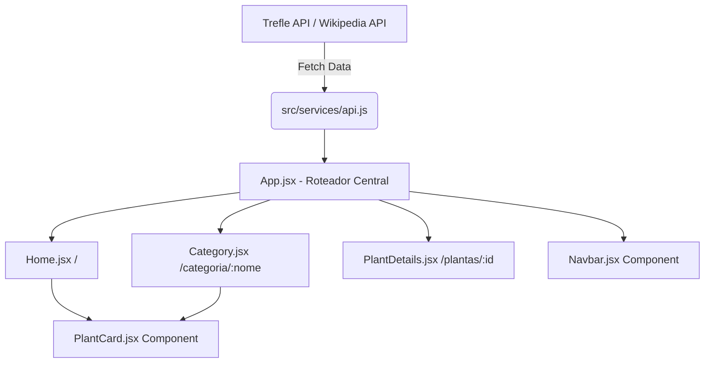

# Guia de Plantas para Paisagismo 🌿

Bem-vindo ao **Guia de Plantas para Paisagismo**, uma aplicação desenvolvida em React para facilitar a busca e descoberta de plantas ideais para o seu ambiente. Este projeto foi desenvolvido como trabalho individual.

## Acesso Online
A aplicação está hospedada e disponível publicamente em:
**(https://guiaplantas.netlify.app/)**

## 💻 Tecnologias e APIs Utilizadas
- **React.js** (Biblioteca principal para construção da interface)
- **Vite** (Ferramenta de build)
- **React Router DOM** (Gerenciamento de rotas e rotas dinâmicas)
- **Vanilla CSS** (Estilização da interface)
- **Trefle Plant API** (Consumo em tempo real de um grande banco de dados botânico mundial)
- **Wikipedia API** (Busca das descrições detalhadas e originais das plantas)
- **MyMemory Translation API** (Tradução das descrições da Wikipedia de inglês para português dinamicamente)

## 🏗️ Arquitetura da Aplicação

A arquitetura foi pensada em componentes isolados, roteamento dinâmico e consumo simultâneo de múltiplas APIs externas:



- **Rotas:**
  - `/` -> Exibe as plantas em destaque trazidas da Trefle API.
  - `/categoria/:nome` -> Rota dinâmica que filtra o catálogo por categoria (Árvores, Flores, Folhagens).
  - `/plantas/:id` -> Rota dinâmica que cruza dados de três APIs (Trefle, Wiki, MyMemory) para montar o perfil completo da planta.

## 📸 Capturas de Tela (Prints)

![Página Inicial] https://prnt.sc/AqHLaGVVLCzr
> A página inicial listando as plantas carregadas da API da Trefle.

![Página de Detalhes da Planta] https://prnt.sc/wxXMwj22w0ot
> Página de detalhes gerada dinamicamente com base no `:id` da planta, contendo a descrição real traduzida dinamicamente da Wikipedia.

## 🚀 Como rodar o projeto localmente

Siga os passos abaixo para testar a aplicação em seu computador:

1. **Clone o repositório:**
   ```bash
   git clone <https://github.com/Beloti99/Projeto-Desenvolvimento-Web-com-API>
   cd guia-plantas
   ```

2. **Instale as dependências necessárias:**
   ```bash
   npm install
   ```

3. **Inicie o servidor de desenvolvimento:**
   ```bash
   npm run dev
   ```

4. **Acesse a aplicação:**
   Abra o seu navegador e acesse a URL que aparecerá no terminal (geralmente `http://localhost:5173/`).

## 🎓 Requisitos do Trabalho
- [x] Aplicação em React com tema livre.
- [x] Consumo e exibição de dados de uma API Externa (O projeto consome **3 APIs diferentes** integradas).
- [x] Hospedada e disponível online (Precisa subir no Vercel/Netlify).
- [x] Mais de uma página interna usando rotas dinâmicas (`/plantas/:id` e `/categoria/:nome`).
- [x] README com arquitetura, tecnologias, instruções e prints.
- [x] Código versionado no GitHub.
